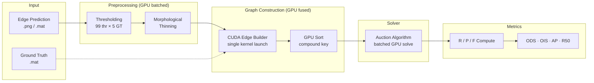

<p align="center">
  <strong>edgeval.cu</strong><br>
  <em>GPU-accelerated edge detection evaluation — ODS · OIS · AP · R50</em>
</p>

<p align="center">
  
  
  <a href="LICENSE"></a>
</p>

---

## Overview

Computing standard edge detection metrics (ODS/OIS/AP/R50) requires solving ~99,000 independent assignment problems — one for every (threshold × ground-truth-annotation) pair across a benchmark dataset. The standard CPU CSA pipeline takes ~20 minutes for BSDS500.

**edgeval.cu** accelerates this with a fused GPU pipeline: batched morphological thinning → CUDA edge builder → GPU sort → batched Auction Algorithm solver. The result: **~0.6s per image, ~2.0 minutes for BSDS500** on an RTX 4090 — a **10× speedup** over CPU.

### Features

- GPU-accelerated evaluation with automatic CPU fallback
- Standard metrics: ODS, OIS, AP, R50
- Two modes: `simple` (fast, ~1.0s/img) and `extended` (CSA-compatible)
- Built-in support for BSDS500, NYUD, BIPED, UDED; custom GT directories
- CLI (`edgeval eval` / `edgeval show` / `edgeval nms` / `edgeval info`)
- Python API for pipeline integration

### Accuracy

GPU Auction solver uses `atomicMax` for tie-breaking, introducing a systematic ODS bias of **∼+0.003** compared to the deterministic CPU CSA solver. This is stable and consistent — suitable for training-time trend monitoring. For paper-quality final evaluation, use CPU CSA mode.

| Mode | Time (200 imgs) | ODS vs CPU CSA |
|------|-----------------|----------------|
| `simple` (GPU) | **3.3 min** | +0.003 |
| `extended` (GPU) | ~14 min | <0.001 |
| CPU CSA | ~20 min | 0 (reference) |

---

## Architecture

The evaluation pipeline formulates edge matching as a **minimum-cost bipartite assignment problem**: persons → predicted edge pixels, objects → ground truth edge pixels, edge costs → Euclidean distance within a `max_dist` search window.



---

## Installation

```bash
git clone https://github.com/0xrjman/edgeval.cu.git
cd edgeval.cu
pip install -e .
cd src/edgeval_cu/gpu_eval && make
```

**Requirements**: Python 3.8+, NumPy, SciPy >= 1.6.0, PyTorch, CUDA 12.x, OpenCV, tqdm.

---

## Quick Start

### 1. Download Ground Truth

Get GT data from [Google Drive](https://drive.google.com/drive/folders/1j1TU28PinKipOh0egf8tbzI7EetAbzKh?usp=sharing) (hosted by [eval-edge-pytorch](https://github.com/Li-yachuan/eval-edge-pytorch)) and unzip into `GT/BSDS500/test/`.

### 2. Prepare Results

Save edge detection outputs as PNG files (0–255) with filenames matching the GT `.mat` files:

```
results/
├── 100007.png
├── 100039.png
└── ...
```

### 3. Run Evaluation

```bash
# GPU evaluation (recommended)
edgeval eval results --gpu --dataset BSDS

# Light version (9 thresholds, ~10x faster)
edgeval eval results --gpu --thrs 9
```

### Python API

```python
from edgeval_cu.gpu_eval import gpu_edges_eval_img, gpu_edges_eval_dir

# Single image
info, _ = gpu_edges_eval_img(edge_map, "GT/100007.mat", thrs=99, mode='simple')

# Full directory
scores = gpu_edges_eval_dir("results", "GT/BSDS500/test", thrs=99, mode='simple')
print(f"ODS: {scores['ods_f']:.4f}  OIS: {scores['ois_f']:.4f}")
```

---

## Performance

Benchmarked on RTX 4090 (CUDA 13.2, sm_89, AMD Ryzen 9 7950X):

| Scenario | CPU CSA | GPU simple | Speedup |
|----------|---------|------------|---------|
| 1 image (99 thr × 5 GT) | ~6 s | **~0.6 s** | **10×** |
| 200 images (BSDS500 full) | ~20 min | **~2.0 min** | **10×** |

### GPU pipeline breakdown (per image)

| Component | Time | % |
|-----------|------|----|
| Batched thinning (×99) | 0.12s | 20% |
| Fused CUDA edge builder | 0.02s | 3% |
| GPU sort + annotator split | 0.08s | 13% |
| Download + problem build | 0.04s | 7% |
| GPU Auction batch solve | 0.24s | 40% |
| Overhead (I/O, upload) | 0.10s | 17% |
| **Total** | **0.60s** | 100% |

---

## CLI Reference

### `edgeval eval`

```
Usage: edgeval eval [OPTIONS] RESULT_DIR

Options:
  -g, --gt-dir PATH   Ground truth directory
  -d, --dataset TEXT  Dataset name: BSDS, NYUD, BIPED, UDED
  --gpu               Use GPU acceleration (default: CPU)
  -f, --full          Full evaluation (99 thresholds)
  --thrs INTEGER      Number of thresholds (9=light, 99=full)  [default: 99]
  --max-dist FLOAT    Max matching distance  [default: 0.0075]
  --no-thin           Skip morphological thinning
  -nw, --not-wait     Do not wait for new results
  --timeout FLOAT     Max hours to wait for results  [default: 8]
  --workers INTEGER   CPU workers  [default: -1]
```

### `edgeval show`

```
Usage: edgeval show [OPTIONS] RESULT_DIR
Options:
  -f, --full  Show full per-image results
```

### `edgeval nms`

```
Usage: edgeval nms [OPTIONS] INPUT_DIR OUTPUT_DIR
Options:
  --key TEXT      Key for .mat files  [default: img]
  --format TEXT   File format: .mat or .npy  [default: .mat]
```

---

## Python API Reference

| Function | Description |
|----------|-------------|
| `gpu_edges_eval_dir(res_dir, gt_dir, mode='simple', ...)` | Full GPU directory evaluation |
| `gpu_edges_eval_img(edge_prob, gt_path, mode='simple', ...)` | Single-image GPU evaluation |
| `batch_solve(problems)` | Batched GPU Auction solver |
| `build_extended_problem(n1, n2, edges, oc)` | Build CSA-compatible extended graph |
| `edges_eval_dir(res_dir, gt_dir, ...)` | CPU CSA evaluation (exact reference) |

---

## Project Structure

```
edgeval.cu/
└── src/edgeval_cu/
    ├── __init__.py
    ├── __main__.py
    ├── cli.py                        CLI entrypoint
    ├── eval_component.py             Evaluation orchestration
    ├── _impl/                        Core modules (CSA, thinning, utilities)
    │   ├── correspond_pixels.py      CPU CSA: fast_match_edge_maps()
    │   ├── bwmorph_thin.py           Zhang-Suen thinning (LUT)
    │   ├── edges_eval_dir.py         PRF curve, ODS/OIS computation
    │   └── cpu_auction.py            Pure Python Auction (reference)
    └── gpu_eval/                     GPU-accelerated pipeline
        ├── gpu_eval.py               Main pipeline (thin + build + solve)
        ├── gpu_auction.py            ctypes wrapper for GPU Auction
        ├── auction_kernel.cu         CUDA Auction kernel (ε-scaling)
        ├── edge_builder.cu           Fused CUDA edge builder (cdist+mask)
        ├── auction_cuda.so           Compiled Auction library
        ├── edge_builder.so           Compiled edge builder library
        └── Makefile
```

---

## Metrics

| Metric | Description |
|--------|-------------|
| ODS | Optimal Dataset Scale — single threshold maximizing F-measure across all images |
| OIS | Optimal Image Scale — per-image optimal thresholds, F-measure averaged |
| AP | Average Precision — area under interpolated precision-recall curve (101-point) |
| R50 | Recall at 50% Precision |

---

## References

- [HED evaluation (MATLAB)](https://github.com/s9xie/hed_release-deprecated/tree/master/examples/eval)
- [extended-berkeley-segmentation-benchmark](https://github.com/davidstutz/extended-berkeley-segmentation-benchmark) — C++ CSA solver (Apache 2.0)
- [edge-eval-python](https://github.com/Walstruzz/edge_eval_python) — Python port
- [Bertsekas, "Auction Algorithms"](https://web.mit.edu/dimitrib/www/Auction_Encycl.pdf)
- [Guo & Hall, "Parallel Thinning"](https://gist.github.com/joefutrelle/562f25bbcf20691217b8)
