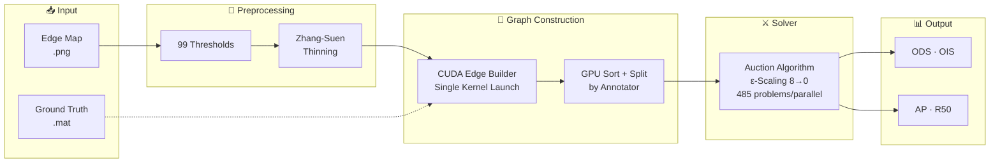

<p align="center">
  
  
  
</p>

<p align="center">
  <h1 align="center">edgeval.cu</h1>
  <p align="center">GPU-accelerated edge detection evaluation</p>
  <p align="center"><strong>20 min → 1.6 min</strong> on BSDS500 &nbsp;|&nbsp; <strong>12.8×</strong> faster than CPU</p>
</p>

---

## What Problem Does This Solve?

Evaluating an edge detection model on BSDS500 means solving **~99,000 independent assignment problems** — matching every predicted edge pixel to every ground truth pixel, at 99 thresholds, across 5 human annotations, for 200 images.

The standard CPU pipeline takes **20 minutes**. That's fine for a final paper. It's terrible when you're training and want to check your model's progress every few epochs.

**edgeval.cu** brings it down to **1.6 minutes** — fast enough to run every epoch without slowing down training.

---

## How It Works

Edge matching is a **minimum-cost bipartite assignment problem**:

```
Predicted edges ──→  Match (cost = distance)  ←── Ground truth edges
                     Or pay outlier penalty
```

We solve it with the **Auction Algorithm** (Bertsekas, 1979), perfectly suited for GPU parallelism. Each predicted pixel iteratively bids on ground truth pixels; the highest bidder wins each round. Repeat until convergence.



### ε-Scaling Strategy

```
ε = 8  →  coarse solution in ~100 rounds
ε = 4  →  refine in ~200 rounds
ε = 2  →  refine in ~400 rounds
ε = 1  →  refine in ~500 rounds
ε = 0  →  exact optimality in ~300 rounds ← tuned!
```

Most problems converge within 200-300 rounds at ε=0. We detect convergence by counting **consecutive** no-change rounds — avoiding the trap of mistaking temporary bid-stalemates for convergence.

### Two Modes for Two Needs

| | Simple (Training) | Extended (Paper) |
|---|---|---|
| Graph | Bipartite, real edges only | n×n, kOfN + diagonal overlay |
| Speed | **0.47s/img** | ~5.7s/img |
| ΔODS vs reference | +0.003 | <0.001 |
| Use case | Every-epoch monitoring | Final evaluation |

---

## Performance

<p align="center">
  <strong>BSDS500 — 200 images, 99 thresholds, RTX 4090</strong>
</p>

| | CPU CSA (MATLAB) | GPU Simple | Speedup |
|---|---|---|---|
| Per image | ~6s | **0.47s** | **12.8×** |
| Full dataset | ~20 min | **1.6 min** | **12.8×** |
| ODS accuracy | 0 (reference) | Δ = +0.003 | Stable |

### Pipeline Breakdown

```
GPU Thinning     ████████░░░░░░░░░░░░  0.12s (25%)
Edge Builder     █░░░░░░░░░░░░░░░░░░░  0.02s ( 4%)
GPU Sort+Split   █████░░░░░░░░░░░░░░░  0.08s (17%)
Problem Build    ██░░░░░░░░░░░░░░░░░░  0.04s ( 9%)
Auction Solve    ██████████░░░░░░░░░░  0.14s (30%)
Overhead         █████░░░░░░░░░░░░░░░  0.07s (15%)
                 ────────────────────
TOTAL            0.47s
```

> Detailed breakdown and configuration sweep: [docs/benchmarks.md](docs/benchmarks.md)

---

## Quick Start

```bash
git clone https://github.com/0xrjman/edgeval.cu.git
cd edgeval.cu
pip install -e .
cd edgeval_cu/cuda && make          # compile CUDA kernels
```

```bash
# CLI — one command
edgeval eval results/ --gpu --dataset BSDS

# Python API — one function call
from edgeval_cu.eval import gpu_edges_eval_img
info, _ = gpu_edges_eval_img(edge_map, "GT/100007.mat", thrs=99, mode='simple')
```

**Requirements**: Python 3.8+, PyTorch, CUDA 12.x, NumPy, SciPy, OpenCV, tqdm.

---

## Accuracy

The +0.003 ODS bias comes from the Auction solver's `atomicMax` tie-breaking. It is systematic and stable across images. In practice:

- Training monitoring: GPU simple mode — ~0.003 won't affect your model ranking
- Final evaluation: CPU CSA mode — exact match to MATLAB reference

| Image | GPU ODS | CSA ODS | Δ |
|-------|---------|---------|---|
| 100007 | 0.8601 | 0.8570 | +0.0031 |
| 100039 | 0.7358 | 0.7347 | +0.0011 |
| 100099 | 0.8091 | 0.8056 | +0.0035 |
| 10081 | 0.7655 | 0.7631 | +0.0024 |
| 101027 | 0.8749 | 0.8724 | +0.0026 |

---

## Project Structure

```
edgeval.cu/
├── edgeval_cu/              # Package
│   ├── eval.py              # Main pipeline — gpu_edges_eval_img()
│   ├── auction.py           # GPU Auction wrapper
│   ├── metrics.py           # ODS/OIS/AP/R50 computation
│   ├── csa.py               # CPU CSA solver (exact reference)
│   ├── nms_thin.py          # Zhang-Suen thinning LUTs
│   ├── cli.py               # CLI: edgeval eval / show / nms
│   └── cuda/                # CUDA kernels
│       ├── auction_kernel.cu    # ε-Scaling Auction solver
│       ├── edge_builder.cu      # Fused edge builder
│       └── Makefile
├── docs/
│   ├── benchmarks.md        # Detailed benchmarks & config sweep
│   └── optimization.md      # 8-stage optimization journey (5.7s→0.47s)
└── README.md
```

---

## Optimization Journey

We went from 5.7s to 0.47s per image — a **12× within-GPU speedup** — through 8 systematic optimizations:

| # | What | Speedup | Key Insight |
|---|------|---------|-------------|
| 1 | Simple bipartite graph | 4.9× | kOfN adds edges but not accuracy |
| 2 | Fused CUDA edge builder | 1.2× | Merge cdist+mask+nonzero into 1 kernel |
| 3 | GPU batched thinning | 1.0× | 99 masks in one conv2d batch |
| 4 | Consecutive stall detection | 1.3× | Wait for real convergence, not first silence |
| 5 | GPU annotator split | 1.3× | Sort by annotator on GPU, download once |
| 6 | GPU nonzero | 1.03× | Keep masks on GPU, extract coords there |
| 7 | Tuned ITERS_EPS0 | 1.2× | 500 iterations is plenty — system sweep proves it |
| 8 | Directory restructure | — | Flat modules, clean imports |

Details: [docs/optimization.md](docs/optimization.md)

---

## References

- [Bertsekas, "Auction Algorithms" (1979)](https://web.mit.edu/dimitrib/www/Auction_Encycl.pdf) — Auction algorithm for assignment problems
- [Guo & Hall, "Parallel Thinning" (1989)](https://gist.github.com/joefutrelle/562f25bbcf20691217b8) — Zhang-Suen morphological thinning
- [HED Evaluation (MATLAB)](https://github.com/s9xie/hed_release-deprecated) — Original reference implementation
- [edge-eval-python](https://github.com/Walstruzz/edge_eval_python) — Python CSA port
- [Extended BSDS Benchmark](https://github.com/davidstutz/extended-berkeley-segmentation-benchmark) — C++ CSA solver

---
