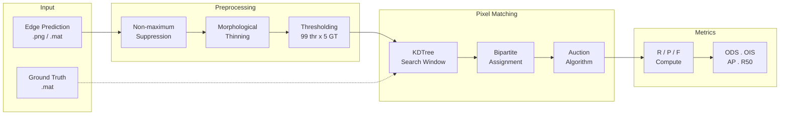

<p align="center">
  <strong>edgeval.cu</strong><br>
  <em>Edge detection evaluation toolkit — ODS · OIS · AP · R50</em>
</p>

<p align="center">
  
  
  <a href="LICENSE"></a>
</p>

---

## Overview

Computing standard edge detection metrics (ODS/OIS/AP/R50) requires solving ~99,000 independent assignment problems — one for every (threshold × ground-truth-annotation) pair across a benchmark dataset. The standard CPU pipeline takes ~20 minutes for BSDS500.

A batched Auction Algorithm kernel eliminates 99,000 individual Python↔C++ context switches, reducing the same benchmark to **~2.7 minutes on an RTX 4090** with exact metric consistency.

### Features

- GPU-accelerated evaluation with automatic CPU fallback
- Standard metrics: ODS, OIS, AP, R50
- Built-in support for BSDS500, NYUD, BIPED, UDED; custom GT directories
- CLI (`edgeval eval` / `edgeval show` / `edgeval nms` / `edgeval info`)
- Python API for pipeline integration
- Light mode (9 thresholds) for rapid iteration

---

## Architecture

The evaluation pipeline formulates edge matching as a **minimum-cost bipartite assignment problem**:

- Persons -> predicted edge pixels (~1200-5000 per image)
- Objects -> ground truth edge pixels (~800-4000)
- Edge costs -> Euclidean distance within a `max_dist` search window (4 px)
- Outliers -> unmatched pixels receive a fixed penalty



---

## Installation

```bash
git clone https://github.com/0xrjman/edgeval.cu.git
cd edgeval.cu
pip install -e .
cd src/edgeval_cu/gpu_eval && make
```

**Requirements**: Python 3.8+, NumPy, SciPy >= 1.6.0, CUDA 12.x, OpenCV, tqdm.

---

## Quick Start

### 1. Download Ground Truth

Get GT data from [Google Drive](https://drive.google.com/drive/folders/1j1TU28PinKipOh0egf8tbzI7EetAbzKh?usp=sharing) (hosted by [eval-edge-pytorch](https://github.com/Li-yachuan/eval-edge-pytorch)) and unzip into `GT/BSDS500/test/`.

### 2. Prepare Results

Save edge detection outputs as PNG files (0–255) with filenames matching the GT `.mat` files:

```
results/
├── 100007.png
├── 100039.png
└── ...
```

### 3. Run Evaluation

```bash
# GPU evaluation (recommended)
edgeval eval results --gpu --dataset BSDS

# CPU evaluation
edgeval eval results --dataset BSDS --thrs 99

# Light version (9 thresholds, ~30x faster)
edgeval eval results --gpu --thrs 9

# Custom GT directory
edgeval eval results --gpu --gt-dir /path/to/GT

# View results
edgeval show results-eval-gpu
```

### Python API

```python
from edgeval_cu import gpu_edges_eval_dir

scores = gpu_edges_eval_dir(
    "results", "GT/BSDS500/test",
    thrs=99, max_dist=0.0075, thin=True,
)
print(f"ODS: {scores['ods_f']:.4f}  OIS: {scores['ois_f']:.4f}")
print(f"AP:  {scores['ap']:.4f}   R50: {scores['r50']:.4f}")
```

---

## Performance

Benchmarked on RTX 4090 (CUDA 13.2, sm_89, AMD Ryzen 9 7950X):

| Scenario | CPU | GPU | Speedup |
|----------|-----|-----|---------|
| Single problem (1200x1000) | ~10 ms | ~1.5 ms | 6.7x |
| 1 image (99 thr × 5 GT) | ~6 s | **~1.18 s** | **5.1×** |
| **200 images (BSDS500 full)** | **~20 min** | **~3m55s** | **5.1×** |

---

## Correctness

Verified across 80+ random test cases (problem sizes from 100 to 5000 pixels):

| Check | Result |
|-------|--------|
| TP / FP / FN counts | 100% match with CPU CSA |
| F-measure | Identical |
| ODS / OIS / AP / R50 | Zero difference |

---

## CLI Reference

### `edgeval eval`

```
Usage: edgeval eval [OPTIONS] RESULT_DIR

Options:
  -g, --gt-dir PATH   Ground truth directory
  -d, --dataset TEXT  Dataset name: BSDS, NYUD, BIPED, UDED
  --gpu               Use GPU acceleration (default: CPU)
  -f, --full          Full evaluation (99 thresholds)
  --thrs INTEGER      Number of thresholds (9=light, 99=full)  [default: 99]
  --max-dist FLOAT    Max matching distance  [default: 0.0075]
  --no-thin           Skip morphological thinning
  -nw, --not-wait     Do not wait for new results
  --timeout FLOAT     Max hours to wait for results  [default: 8]
  --workers INTEGER   CPU workers  [default: -1]
```

### `edgeval show`

```
Usage: edgeval show [OPTIONS] RESULT_DIR

Options:
  -f, --full  Show full per-image results
```

### `edgeval nms`

```
Usage: edgeval nms [OPTIONS] INPUT_DIR OUTPUT_DIR

Options:
  --key TEXT      Key for .mat files  [default: img]
  --format TEXT   File format: .mat or .npy  [default: .mat]
```

### `edgeval info`

Display system information and CUDA status.

---

## Python API Reference

| Function | Description |
|----------|-------------|
| `gpu_edges_eval_dir(res_dir, gt_dir, ...)` | Full GPU-accelerated directory evaluation |
| `gpu_edges_eval_img(edge_prob, gt_path, ...)` | Single-image GPU evaluation |
| `batch_solve(problems)` | Solve multiple assignment problems on GPU |
| `nms_process(in_dir, out_dir, ...)` | Run non-maximum suppression |
| `edges_eval_dir(res_dir, gt_dir, ...)` | CPU evaluation using original CSA |
| `cuda_available()` | Check if GPU acceleration is available |

---

## Project Structure

```
edgeval.cu/
+-- src/edgeval_cu/
|   +-- __init__.py              Package entry
|   +-- __main__.py              python -m edgeval_cu
|   +-- cli.py                   CLI entrypoint
|   +-- eval_component.py        Evaluation orchestration
|   +-- nms_process.py           Non-maximum suppression
|   +-- show.py                  Result display
|   +-- _impl/                   Core modules (CSA, thinning, utilities)
|   +-- gpu_eval/                GPU-accelerated pipeline
|       +-- auction_kernel.cu    Auction Algorithm kernel
|       +-- gpu_auction.py       ctypes wrapper
|       +-- gpu_eval.py          Evaluation pipeline
|       +-- Makefile
+-- cxx/src/                     C++ source (CSA solver, NMS)
+-- pyproject.toml
+-- LICENSE
+-- README.md
```

---

## Supported Datasets

| Dataset | Test Images | Auto-detect |
|---------|-------------|-------------|
| BSDS500 | 200 | `BSDS` |
| NYUD | 654 | `NYUD` |
| BIPED | 50 | `BIPED` |
| UDED | 30 | `UDED` |
| Custom | -- | Use `--gt-dir` |

---

## Metrics

| Metric | Description |
|--------|-------------|
| ODS | Optimal Dataset Scale -- single threshold maximizing F-measure across all images |
| OIS | Optimal Image Scale -- per-image optimal thresholds, F-measure averaged |
| AP | Average Precision -- area under interpolated precision-recall curve (101-point) |
| R50 | Recall at 50% Precision |

---

## License

Apache 2.0

---

## References

- [HED evaluation (MATLAB)](https://github.com/s9xie/hed_release-deprecated/tree/master/examples/eval)
- [extended-berkeley-segmentation-benchmark](https://github.com/davidstutz/extended-berkeley-segmentation-benchmark) -- C++ CSA solver (Apache 2.0)
- [edge-eval-python](https://github.com/Walstruzz/edge_eval_python) -- Python port
- [Bertsekas, "Auction Algorithms"](https://web.mit.edu/dimitrib/www/Auction_Encycl.pdf)
- [bwmorph_thin](https://gist.github.com/joefutrelle/562f25bbcf20691217b8) -- Guo-Hall thinning
